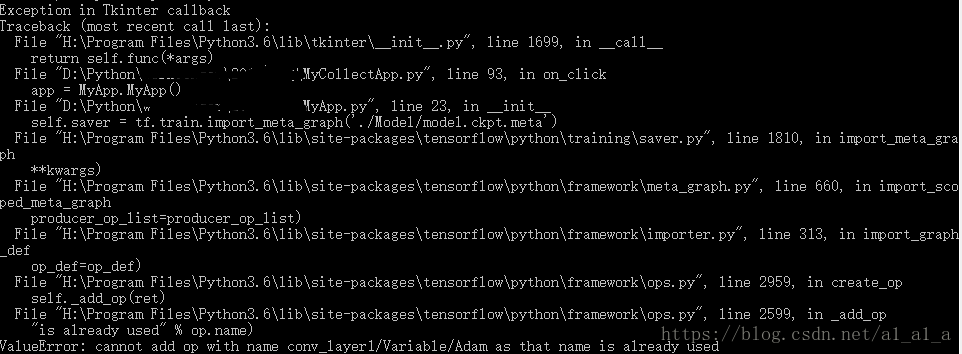

---
prev:
  text: '返回Python手册'
  link: '../'
---

# Tensorflow 释放内存
> [CSDN博客](https://blog.csdn.net/a1_a1_a/article/details/80173144?spm=1001.2014.3001.5502)

我在做tensorflow开发的时候遇到如下的错误，我请教了深度学习社区q群中的大神，大神说这是运算图还在内存中，没有及时释放，需要restart一下kernel，但是由于我的代码不能停止执行，所以没办法用重新运行代码来解决释放内存运行图的问题。

## 问题
```python
with tf.Session() as sess:
saver = tf.train.Saver()  #保存运算图
```

当我退出with并且立马执行

```python
self.sess = tf.Session()
self.saver = tf.train.import_meta_graph('./Model/model.ckpt.meta')
self.saver.restore(self.sess, tf.train.latest_checkpoint('./Model/'))
```

的时候由于session和graph没有释放内存的运算图就产生了报错，



## 解决办法
在with tf.Session() as sess:  之后同时也要在with的范围以外（注意），添加
```python
tf.reset_default_graph()
```

代码来重置默认的图，这样就能解决我下一步执行代码
```python
self.sess = tf.Session()
self.saver = tf.train.import_meta_graph('./Model/model.ckpt.meta')
self.saver.restore(self.sess, tf.train.latest_checkpoint('./Model/'))
```
所产生的问题了。
