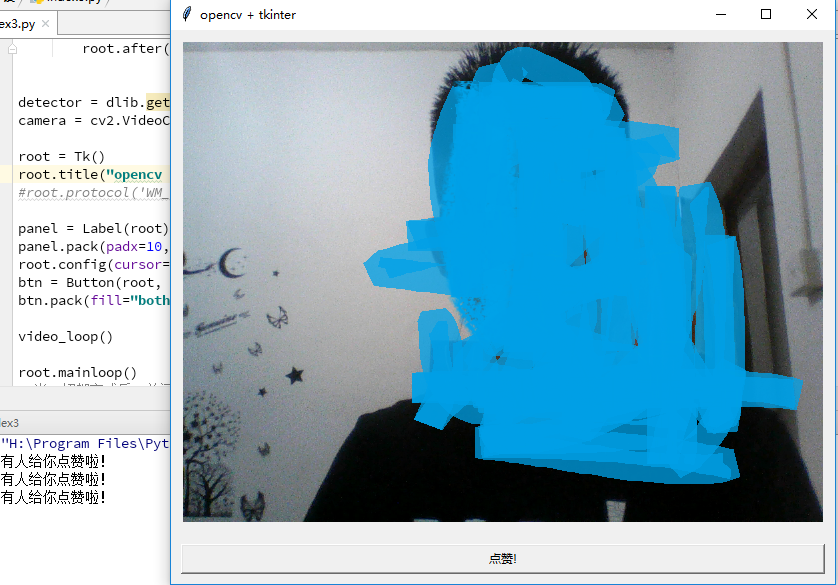

---
prev:
  text: '返回Python手册'
  link: '../'
---

# Python+opencv+tkinter整合demo完成！
> [CSDN博客](https://blog.csdn.net/a1_a1_a/article/details/79981788?spm=1001.2014.3001.5502) 

由于需要使用opencv进行小demo开发但是由于opencv所带的GUI功能目前还是很简单的，所以使用opencvv+tkinter组合实现！
先上结果图！



在GUI中点击点赞按钮在控制台就可以显示”有人给你点赞“。

直接上代码：

```python
from tkinter import *
import cv2
from PIL import Image,ImageTk

def take_snapshot():
    print("有人给你点赞啦！")

def video_loop():
    success, img = camera.read()  # 从摄像头读取照片
    if success:
        cv2.waitKey(1000)
        cv2image = cv2.cvtColor(img, cv2.COLOR_BGR2RGBA)#转换颜色从BGR到RGBA
        current_image = Image.fromarray(cv2image)#将图像转换成Image对象
        imgtk = ImageTk.PhotoImage(image=current_image)
        panel.imgtk = imgtk
        panel.config(image=imgtk)
        root.after(1, video_loop)

camera = cv2.VideoCapture(0)    #摄像头

root = Tk()
root.title("opencv + tkinter")
#root.protocol('WM_DELETE_WINDOW', detector)

panel = Label(root)  # initialize image panel
panel.pack(padx=10, pady=10)
root.config(cursor="arrow")
btn = Button(root, text="点赞!", command=take_snapshot)
btn.pack(fill="both", expand=True, padx=10, pady=10)

video_loop()
root.mainloop()
# 当一切都完成后，关闭摄像头并释放所占资源
camera.release()
cv2.destroyAllWindows()
```

代码中有详细注释，就不详细描述了

代码直接复制粘贴到本地即可运行！
