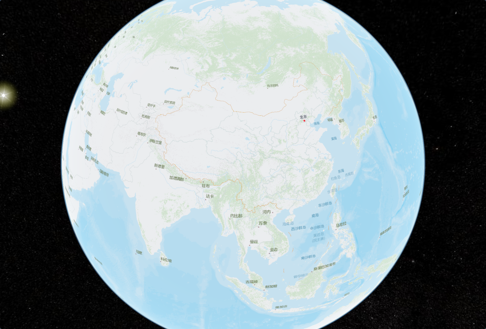

# 使用 Vite + Vue3 创建 Cesium 项目

> [Cesium: The Platform for 3D Geospatial](https://cesium.com/)
>
> [Vite | 下一代的前端工具链 (vitejs.dev)](https://cn.vitejs.dev/)
>
> [Vue.js - 渐进式 JavaScript 框架 | Vue.js (vuejs.org)](https://cn.vuejs.org/)


## 使用 Vite 创建 VUE3 项目

1. 使用命令 `pnpm create vite` 创建项目，然后按照提示操作即可！本项目使用了 `VUE` 、`Typescript` 。

2. 进入项目然后执行命令 `pnpm install` 进行依赖下载。

3. 最后执行命令 `pnpm run dev` 启动项目后就可以在浏览器看到项目页面了。


## 项目依赖插件

**vite-plugin-cesium ：** 执行命令 `pnpm i vite-plugin-cesium -D` 进行依赖下载，会自动下载 `cesium`

## 项目配置

在 `vite.config.ts` 中配置 `cesium` 插件

```typescript
import { defineConfig, loadEnv } from 'vite'
import vue from '@vitejs/plugin-vue'
import cesium from 'vite-plugin-cesium';

// https://vitejs.dev/config/
export default defineConfig({
    plugins: [
        vue(),
        cesium(),
      ]
  }
})

```

## 页面

```Vue
<template>
  <div class="container" ref="container"></div>
</template>
<script setup lang="ts">
import * as Cesium from "cesium"
import "cesium/Build/Cesium/Widgets/widgets.css";
Cesium.Ion.defaultAccessToken = "you token"

import { onMounted, ref, shallowRef } from 'vue';
const container = ref<HTMLDivElement>()
const viewer = shallowRef<Cesium.Viewer>()

onMounted(async () => {
  Cesium.Camera.DEFAULT_VIEW_RECTANGLE = Cesium.Rectangle.fromDegrees(
    75.0, // 西经
    0.0, // 南纬
    140.0, // 东经
    60.0 // 北纬
  );
  viewer.value = new Cesium.Viewer(container.value as HTMLElement, {
    terrainProvider: new Cesium.EllipsoidTerrainProvider({}), //移除自带地形
    geocoder: false,                //是否显示地名查找控件
    sceneModePicker: false,         //是否显示投影方式控件
    navigationHelpButton: false,    //是否显示帮助信息控件
    baseLayerPicker: false,         //是否显示图层选择控件
    homeButton: false,              //是否显示Home按钮
    fullscreenButton: false,        //是否显示全屏按钮    
    timeline: false,                //时间轴控件 
    animation: false,               //动画控件
    selectionIndicator : false,
    infoBox : false
  });
  (viewer.value.cesiumWidget.creditContainer as HTMLElement).style.display = "none";
  // 删除默认的贴图
  viewer.value.imageryLayers.removeAll()
  // 禁用双击
  viewer.value.screenSpaceEventHandler.setInputAction(function(){},Cesium.ScreenSpaceEventType.LEFT_DOUBLE_CLICK );
  // 添加瓦片贴图
  viewer.value.imageryLayers.addImageryProvider(
    new Cesium.UrlTemplateImageryProvider({
      url: 'https://map.geoq.cn/ArcGIS/rest/services/ChinaOnlineCommunity/MapServer/tile/{z}/{y}/{x}', 
    })
  );

})
</script>

<style scoped>
.container {
  width: 100%;
  height: 100%;
  background-color: aquamarine;

}
</style>

```

经过上面几步就可以完成 `cesium` 的最基本显示功能了

