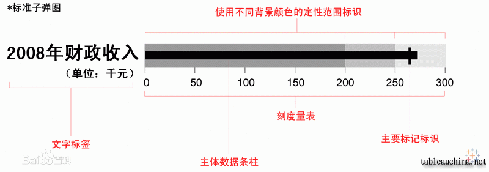

---
prev:
  text: 'Ecahrts 案例'
  link: '../index'
---

# 子弹图
> 子弹图，顾名思义是由于该类信息图的样子很像子弹射出后带出的轨道。

## 介绍说明



## 实现思路：
1. 使用默认的（堆叠）柱状图作为背景，并禁止其与鼠标进行交互
2. 使用散点图作为一个特殊标识的气泡（竖线）
3. 设置一个柱状图作为最终数据展示


## 最终输出：
<ClientOnly>
  <bullet isSelf />
</ClientOnly>

<script setup>
import bullet from '../components/bullet.vue'
</script>


配置如下：
```typescript
const baseData = [
  {
    name: '不及格',
    color: 'red',
    data: [60]
  },
  {
    name: '及格',
    color: '#fac858',
    data: [10]
  },
  {
    name: '良好',
    color: '#5470c6',
    data: [10]
  },
  {
    name: '优秀',
    color: 'green',
    data: [20]
  }
]
const data = {
  name: 'name00',
  estimateName: '预估值',
  estimate: 85,
  valueName: "实际值",
  value: 75
}
rightChart.value = echarts.init(rightChartDom.value);
const options = {
  title: {
    text: "子弹图示例"
  },
  tooltip: {},
  legend: {
    data: [...baseData.map(i => i.name), {
      name: data.estimateName,
      icon: 'path://M0 0M443.733333 0 h145.066667 v1024 H443.733333z'
    }, data.valueName],
    selectedMode: false
  },
  grid: {
    containLabel: true,
    width: "99%",
    left: 0,
  },
  xAxis: {
    type: 'value',
    axisLine: {
      show: false
    },
    axisTick: {
      show: false
    }
  },
  yAxis: [
    {
      type: 'category',
      data: [data.name],
      axisLine: {
        show: false
      },
      axisTick: {
        show: false
      }
    },
    {
      type: 'category',
      data: [''],
      axisLine: {
        show: false
      },
      axisTick: {
        show: false
      }
    }
  ],
  series: [
      ...baseData.map(i => {
        return {
          type: 'bar',
          yAxisIndex: 0,
          stack: "range",
          silent: true,
          barWidth: 40,
          ...i
        }
      }),
      {
        name: data.estimateName,
        type: "scatter",
        symbol: "rect",
        symbolSize: [2, 50],
        color: "#000000",
        hoverAnimation: false,
        data: [data.estimate],
      },
      { // 子弹图第一种形式
        name: data.valueName,
        type: "scatter",
        symbol: "circle",
        symbolSize: [20, 20],
        yAxisIndex: 1,
        color: "#71c1df",
        data: [data.value + 10],
      },
      { // 子弹图第二种形式
        name: data.valueName,
        type: 'bar',
        yAxisIndex: 1,
        barWidth: 20,
        color: "#71c1df",
        data: [{
          value: data.value,
          itemStyle: {
            borderRadius: [0, 10, 10, 0]
          }
        }],
      }
    ]
};
rightChart.value.setOption(options)
```


参考文档：
[Echarts Grid](https://echarts.apache.org/zh/option.html#grid)
[Echarts scatter](https://echarts.apache.org/zh/option.html#series-scatter.type)
[百度百科 子弹图](https://baike.baidu.com/item/%E5%AD%90%E5%BC%B9%E5%9B%BE)
