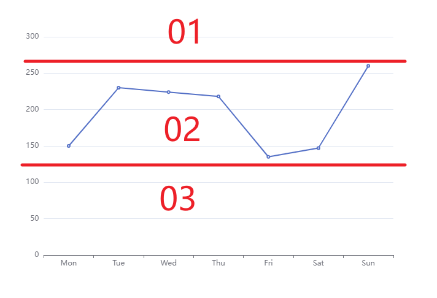

---
prev:
  text: 'Ecahrts 案例'
  link: '../index'
---

# Y轴范围动态等分
## 介绍说明

当我们使用echarts官方默认的折线图表进行图表绘制的时候可能会出现如下情况：
<ClientOnly>
  <dynamicBisection isDefault />
</ClientOnly>

所有的数据都聚集在`70%`左右，在数据集更大的情况下我们无法很好的区分数据间的差距。

所以我们需要优化其配置，以便更好的体现出数据的变化趋势。

## 实现思路：
1. 缩小`Y`轴的显示范围，如本案例中取 `65%` - `75%` 这样的一个范围（假设）
2. 设置`Y`轴的分段数动态设置，这样可以更好的体现我们所要的折线趋势。


## 具体实现：
1. 动态设置`Y`轴取值范围，例如如下所采用的三段式的显示方案



算法如下：
```typescript
// min: 数据中的最小值， max：数据中的最大值
const getLeftData = function (min: number, max: number) {
  // 得到最大值和最小值之间的差值
  const diff = max - min
  const _max = max + diff
  const _min = min - diff

  // 得到最终的Y轴所需要显示的范围
  return {
    max: _max,
    min: _min,
  };
}
```

2. 设置`Y`轴的分段数动态设置，可在上一步的算法中加入一个返回值
```typescript
const intervalNum = 5 // 所要切割的分段数
// min: 数据中的最小值， max：数据中的最大值
const getLeftData = function (min: number, max: number) {
  // 得到最大值和最小值之间的差值
  const diff = max - min
  const _max = max + diff
  const _min = min - diff

  // 得到最终的Y轴所需要显示的范围和分段数间隔
  return {
    max: _max,
    min: _min,
    interval: (_max - _min) / intervalNum,
  };
}
```


## 最终输出：
<ClientOnly>
  <dynamicBisection isSelf />
</ClientOnly>

配置如下：
```typescript
const data = [
  { name: 'name00', value: 70 },
  { name: 'name01', value: 71 },
  { name: 'name02', value: 70.5 },
  { name: 'name03', value: 71.1 },
  { name: 'name04', value: 70.8 },
  { name: 'name05', value: 71.2 }
]
const myChart = echarts.init(rightChart.value);
// 准备数值数据
const dataList = data.map(i => i.value)
const intervalNum = 5 // 切割份数
// 计算数据最大值和最小值
const maxValue = Math.max(...dataList);
const minValue = Math.min(...dataList)
// 计算间隔，返回y轴最大值，y轴最小值 ，间隔
const getLeftData = function (min: number, max: number) {
  const diff = max - min
  const _max = max + diff
  const _min = min - diff
  return {
    max: _max,
    min: _min,
    interval: (_max - _min) / intervalNum,
  };
}
const interObj = getLeftData(minValue, maxValue)
const options = {
  xAxis: {
    type: 'category',
    data: data.map(i => i.name),
  },
  yAxis: {
    type: 'value',
    interval: interObj.interval,
    min: interObj.min,
    max: interObj.max,
    axisLabel: {
      interval: 'auto',
      formatter: function (value: number) {
        return value.toFixed(2) + '%';
      }
    },
    splitLine: {
      show: true
    },
  },
  series: [{
    data: dataList,
    type: 'line',
  }]
};
myChart.setOption(options)
```

<script setup>
import { onMounted, ref } from 'vue';
import dynamicBisection from '../components/dynamicBisection.vue'
</script>
