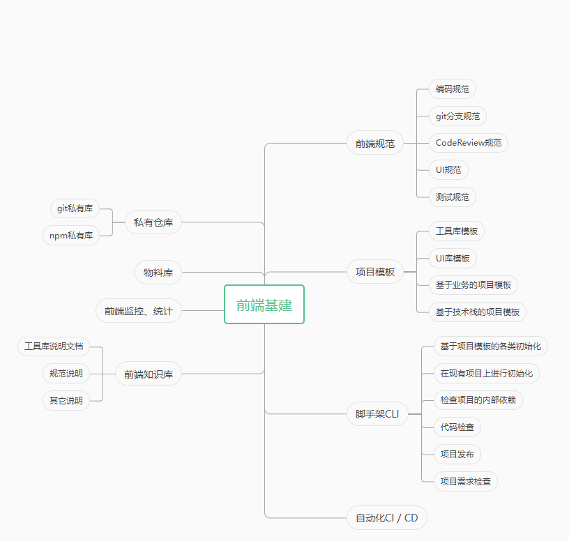

# 前端基建

一个小的前端团队一般会存在着很多问题，例如：
1. 前后端整合到一个地方，部署线上也在同一个服务器（虽然不一定每个项目需要前后端分离）
2. 前端代码格式混乱，项目部署流程麻烦
3. 产品没有设计、产品等，开发流程不规范、需求不明确
4. 项目周期拍脑袋决策，没有一个合理的开发排期
5. 开发没有进行项目复盘与项目积累
6. `webpack` 更迭，导致项目中构建版本参差不齐，难以维护
7. 各个项目生产环境打包结构差异，难以控制结构，造成的运维负担；

**前端基建一般有如下的思路：**

