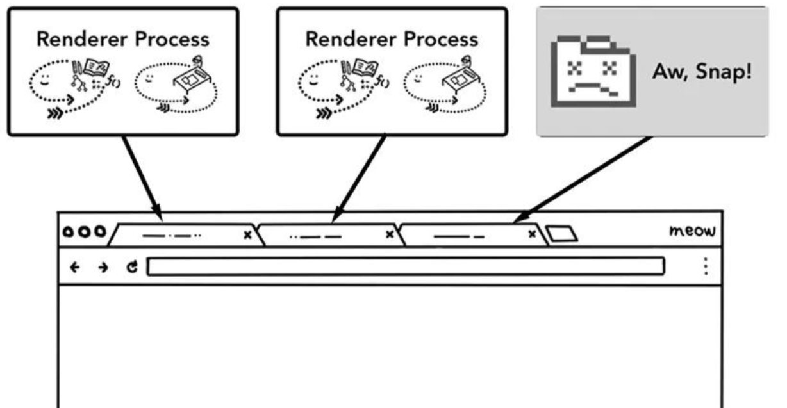
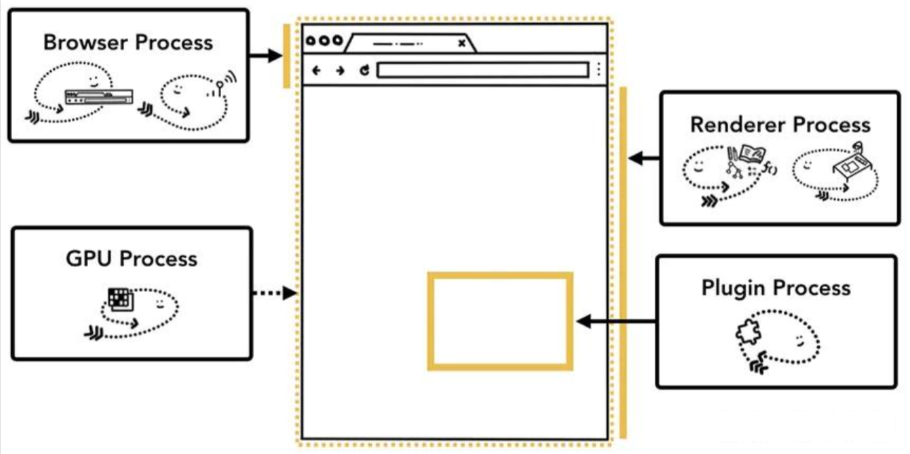
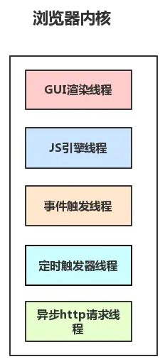
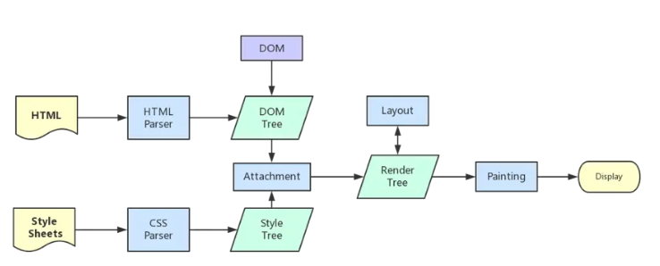

# 浏览器原理

## 前言

::: info
进程（process）：是程序的一次执行过程，是一个动态概念，是程序在执行过程中分配和管理资源的基本单位
线程（thread）：是CPU调度和分派的基本单位，它可与同属一个进程的其他的线程共享进程所拥有的全部资源。
:::

线程是跑在进程里面的，一个进程里面可能有一个或者多个线程，而一个线程，只能隶属于一个进程。
浏览器一般为多进程程序，例如Chrome。但是由于进程与进程之间的内存空间是无法共享的，所以需要使用IPC机制（Inter Process Communication）来进行通讯。

## 多进程架构的好处

1. 更高的容错性，现代的WEB应用是非常复杂的，但是又无法保证其WEB应用没有任何BUG，当渲染进程执行到BUG位置的时候有可能就会直接崩溃，但是在多进程架构下每一个Tab页面都是一个单独的进程，所以当其中一个Tab页面崩溃的话也不会影响到其他Tab页面。如下图所示：
2. 更高的安全性和沙盒性（sanboxing），浏览器为了更好更安全的执行并加载网络上的资源（JS、HTML、CSS、图片、视频、音频等）设计了不同访问权限的多线程架构（例如：渲染进程无法直接读取/操作本地文件），并提供了运行沙盒。
3. 更高的响应速度，在单进程的架构中，各个任务相互竞争抢夺CPU资源，使得浏览器响应速度变慢，多进程架构就解决了这样的一个问题。

## 浏览器架构

在Chrome中，主要的进程有4个：
1. **浏览器进程 (Browser Process)：** 负责浏览器的TAB的前进、后退、地址栏、书签栏的工作和处理浏览器的一些不可见的底层操作，比如网络请求和文件访问。
2. **渲染进程 (Renderer Process)：** 负责一个Tab内的显示相关的工作，也称渲染引擎。
3. **插件进程 (Plugin Process)：** 负责控制网页使用到的各种插件。
4. **GPU进程 (GPU Process)：** 负责处理整个应用程序的GPU任务。

### 浏览器进程 (Browser Process)

1. UI线程 (UI thread): 控制浏览器上的按钮及输入框
2. 网络线程 (network thread / network service process): 处理网络请求，从网上获取数据。
3. 存储线程 (storage thread): 控制文件等的访问

### 渲染进程 (Renderer Process)

1. **GUI渲染线程**

   负责渲染浏览器界面，解析HTML，CSS，构建DOM树和RenderObject树，布局和绘制等，当界面需要重绘（Repaint）或由于某种操作引发回流(reflow)时，该线程就会执行。
   
   ::: warning
   
   **GUI渲染线程与JS引擎线程是互斥的**，当JS引擎执行时GUI线程会被挂起（相当于被冻结了），GUI更新会被保存在一个队列中**等到JS引擎空闲时**立即被执行。
   
   :::
   
   
   
   
   
2. **JS引擎线程**

   （例如V8引擎）JS引擎线程负责解析Javascript脚本，运行代码。JS引擎一直等待着任务队列中任务的到来，然后加以处理，一个Tab页（renderer进程）中无论什么时候都只有一个JS线程在运行JS程序
   
   ::: warning
   
   **GUI渲染线程与JS引擎线程是互斥的**，当JS引擎执行时GUI线程会被挂起（相当于被冻结了），GUI更新会被保存在一个队列中**等到JS引擎空闲时**立即被执行。
   
   :::
   
   

3. **事件触发线程**

     归属于浏览器而不是JS引擎，用来控制事件循环。当JS引擎执行代码块如setTimeOut时（也可来自浏览器内核的其他线程,如鼠标点击、AJAX异步请求等），会将对应任务添加到事件线程中，当对应的事件符合触发条件被触发时，该线程会把事件添加到待处理队列的队尾，等待JS引擎的处理。

     

4. **定时器出发线程**

     传说中的setInterval与setTimeout所在线程
     浏览器定时计数器并不是由 JavaScript引擎 计数的,（因为JavaScript引擎是单线程的, 如果处于阻塞线程状态就会影响记计时的准确）
     因此通过单独线程来计时并触发定时（计时完毕后，添加到事件队列中，等待JS引擎空闲后执行）
     注意，W3C在HTML标准中规定，规定要求setTimeout中低于4ms的时间间隔算为4ms。（也就是0ms也算4ms）

5. **异步HTTP请求线程**

     在XMLHttpRequest连接后是通过浏览器新开一个线程请求
     将检测到状态变更时，如果设置有回调函数，异步线程就产生状态变更事件，将这个回调再放入事件队列中。再由JavaScript引擎执行。

6. **合成线程**

     在GUI渲染线程后执行，将GUI渲染线程生成的带绘制列表转换为位图。

7. **IO线程**

     用来和其他进程进行通信，例如： 网络进程下载完成以后就会将信息发送给 IO 线程，通过IPC 通信。当用户点击页面按钮，浏览器主线程就会把这个信息通过 IPC 发送给 IO 线程。IO 线程会将这个时间包装成任务添加到消息队列里面，供事件循环机制不断处理。

（浏览器内核）

（渲染流程）

### 插件进程 (Plugin Process)

### GPU进程 (GPU Process)
