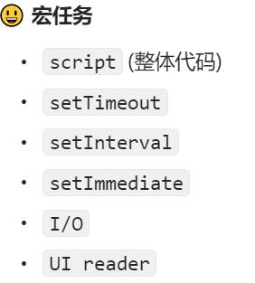
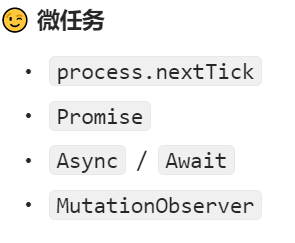

# JS事件循环机制
JavaScript的事件循环机制是一种用于处理异步操作的机制，它确保了JavaScript代码的顺序执行和非阻塞特性。

事件循环机制的核心是一个事件循环（Event Loop），它不断地从任务队列（Task Queue）中取出任务并执行。任务队列分为两种：宏任务队列（Macrotask Queue）和微任务队列（Microtask Queue）。

**宏任务** 包括整体代码块（script），setTimeout，setInterval等。当执行一个宏任务时，会执行其对应的代码，并将其中的微任务添加到微任务队列中。

**微任务** 包括Promise回调函数，MutationObserver回调函数等。当执行一个微任务时，会执行其对应的代码。




**事件循环的执行过程如下：**
1. 执行完当前的宏任务。
2. 检查微任务队列，如果有微任务，则依次执行所有微任务，直到微任务队列为空。
3. 更新页面渲染（如果需要）。
4. 从宏任务队列中取出一个任务，执行该任务。如果宏任务队列为空，则等待新的任务加入。
5. 跳转到第2步，继续执行。

::: tip
需要注意的是，事件循环是单线程的，即一次只能执行一个任务。而异步操作（例如定时器、异步请求等）会被放入任务队列中，等待事件循环执行。
:::

这种事件循环机制使得JavaScript能够处理大量的异步操作，同时保证代码的执行顺序和非阻塞特性。

Demo：
``` javascript
Promise.resolve().then(()=>{
  console.log('第一个回调函数：微任务1')  
  setTimeout(()=>{
    console.log('第三个回调函数：宏任务2')
  },0)
})
setTimeout(()=>{
  console.log('第二个回调函数：宏任务1')
  Promise.resolve().then(()=>{
    console.log('第四个回调函数：微任务2')   
  })
},0)

// 第一个回调函数：微任务1
// 第二个回调函数：宏任务1
// 第四个回调函数：微任务2
// 第三个回调函数：宏任务2
```


## 浏览器事件循环机制
浏览器的事件循环标准是由 HTML 标准规定的，具体来说就是由whatwg规定的，具体内容可以参考 [event-loops in browser](https://html.spec.whatwg.org/multipage/webappapis.html#event-loops)


## Node 事件循环机制
在 Node.js 中，事件循环（Event Loop）是异步编程的核心机制之一。事件循环是 Node.js 中实现异步编程的一种机制，它基于事件和回调函数机制实现。事件循环不断地监听和处理事件，每个事件都对应一个回调函数。当事件被触发时，事件循环会执行相应的回调函数，处理完后再返回到事件循环中继续监听和处理事件。

```javascript
     ┌───────────────────────────┐
  ┌─>│           timers          │
  │  └─────────────┬─────────────┘
  │  ┌─────────────┴─────────────┐
  │  │     pending callbacks     │
  │  └─────────────┬─────────────┘
  │  ┌─────────────┴─────────────┐
  │  │       idle, prepare       │
  │  └─────────────┬─────────────┘      ┌───────────────┐
  │  ┌─────────────┴─────────────┐      │   incoming:   │
  │  │           poll            │<─────┤  connections, │
  │  └─────────────┬─────────────┘      │   data, etc.  │
  │  ┌─────────────┴─────────────┐      └───────────────┘
  │  │           check           │
  │  └─────────────┬─────────────┘
  │  ┌─────────────┴─────────────┐
  └──┤      close callbacks      │
     └───────────────────────────┘
```

## 事件循环机制差异
NodeJS中事件循环其实也略有不同，具体可以参考 [event-loops in nodejs](https://nodejs.org/en/guides/event-loop-timers-and-nexttick#what-is-the-event-loop)

1. 执行环境：Node.js是在服务器端执行的JavaScript运行时，而浏览器是在客户端执行的。因此，它们的执行环境和目标不同。

2. Event Loop实现：Node.js使用libuv库实现事件循环，而浏览器使用浏览器引擎的内置事件循环。

3. 定时器实现：Node.js使用基于时间的定时器，如setTimeout和setInterval，它们是基于libuv库的功能实现的。而浏览器使用setTimeout和setInterval，但还有其他定时器API，如requestAnimationFrame。

4. I/O操作：Node.js是为处理I/O操作而设计的，因此在事件循环中有专门的阶段来处理I/O操作。而浏览器的事件循环主要用于处理用户交互事件和渲染。

5. 异步API：Node.js提供了一些与服务器端操作相关的异步API，如文件系统操作和网络请求。而浏览器提供了一些与浏览器环境相关的异步API，如DOM操作和AJAX请求。

6. 进程和线程：Node.js是单线程的，但通过事件循环和异步操作可以处理高并发。而浏览器是多线程的，其中有一个主线程用于处理用户交互和渲染，还有其他线程用于处理网络请求和其他任务。

总的来说，虽然Node.js和浏览器都使用事件循环机制来处理异步操作，但它们的实现和重点略有不同，以适应它们不同的执行环境和需求。
