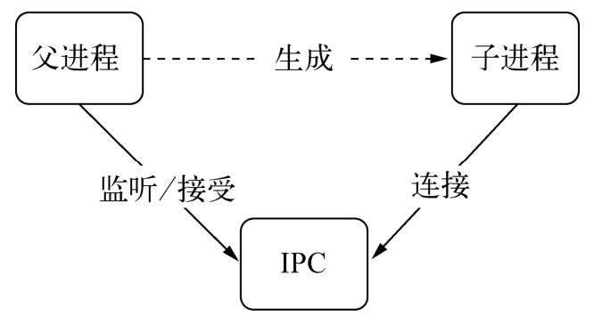
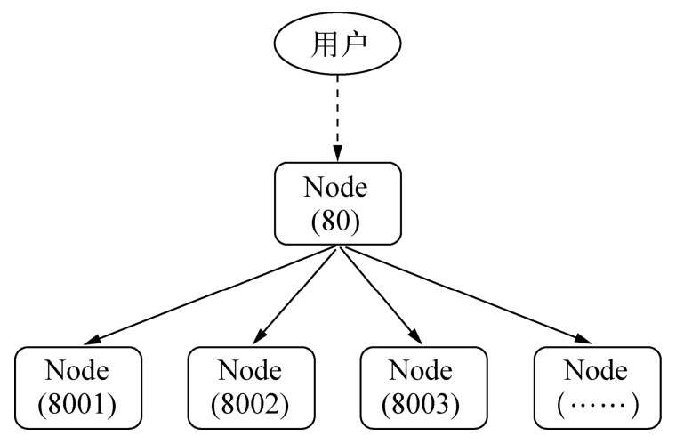
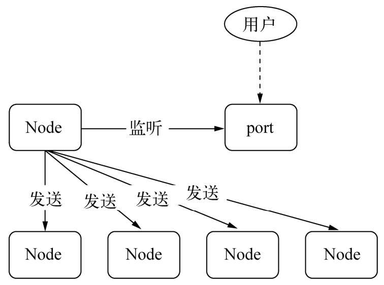
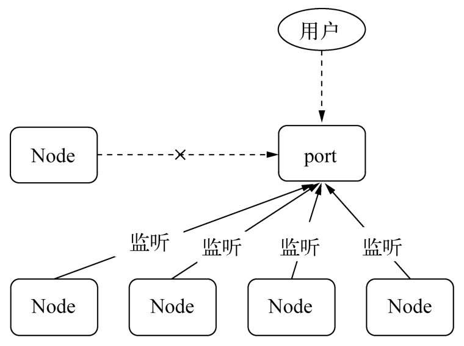

---
prev:
  text: '返回前端手册'
  link: '../'
---

# JS多进程的了解

## 图概


## 前言
我们常说：**“JavaScript是单线程的“**，说法虽然有些简单，但描述了JavaScript在浏览器中的一般行为。它带来的好处是：
* 程序状态是单一的，在没有多线程的情况下没有锁、线程同步问题，操作系统在调度时也因为较少上下文的切换，可以很好地提高CPU的使用率。
* 假如JavaScript可以多线程执行并发更改，那么像常用操作页面DOM这样的API就会出现问题。

**Node(服务端)** 在选型时决定在V8引擎之上构建，也就意味着它的模型与浏览器类似。

**单线程并非完美的结构**，需求的多样化，已不满足仅仅单线程的操作。

如今CPU基本均是多核的，真正的服务器（非VPS）往往还有多个CPU。

一个Node进程只能利用一个核，这将抛出Node实际应用的第一个问题：如何充分利用多核CPU服务器？


以下内容，进行探寻一二。

## 工作者线程介绍
js环境实际上是运行在托管操作系统中的虚拟环境。在浏览器中每打开一个页面，就会分配一个它自己的环境。这样，每个页面都有自己的内存、事件循环、DOM，等等。每个页面就相当于一个沙盒，不会干扰其他页面。

对于浏览器来说，同时管理多个环境是非常简单的，因为所有这些环境都是并行执行的。

工作者线程规范定义重要三种：
* 专用工作者线程-WebWorkers
* 共享工作者线程-SharedWorker
* 服务工作者线程-ServiceWorkers

三种工作线程作用域API，继承<code>WorkerGlobalScope</code>类, 注意，在工作者线程内部，没有`window`全局变量的概念，故常用api通过<code>WorkerGlobalScope</code>的属性与方法。
* 专用工作者线程使用DedicatedWorkerGlobalScope。
* 共享工作者线程使用SharedWorkerGlobalScope。
* 服务工作者线程使用ServiceWorkerGlobalScope。

**WorkerGlobalScope常用属性：**
* navigator：返回与工作者线程关联的WorkerNavigator。
* self：返回WorkerGlobalScope对象。
* location：返回与工作者线程关联的WorkerLocation。
* performance：返回（只包含特定属性和方法的）Performance对象。
* console：返回与工作者线程关联的Console对象；对API没有限制。
* caches：返回与工作者线程关联的CacheStorage对象；对API没有限制。
* indexedDB：返回IDBFactory对象。
* isSecureContext：返回布尔值，表示工作者线程上下文是否安全。
* origin：返回WorkerGlobalScope的源。

**WorkerGlobalScope常用方法：**
* atob()
* btoa()
* clearInterval()
* clearTimeout()
* createImageBitmap()
* fetch()
* setInterval()

**详细文档：**
[MDN-WorkerGlobalScope文档](https://developer.mozilla.org/en-US/docs/Web/API/WorkerGlobalScope)


## Web Workers-专用工作者线程
专用工作者线程，称为工作者线程、Web Worker或Worker，是一种实用的工具，可以让脚本单独创建一个JavaScript线程，以执行委托的任务。专用工作者线程，顾名思义，只能被创建它的页面使用。

使用场景：可以与父页面交换信息、发送网络请求、执行文件输入/输出、进行密集计算、处理大量数据，以及实现其他不适合在页面执行线程里做的任务（否则会导致页面响应迟钝）。

::: info
**注意** 不能使用非同源脚本创建工作者线程，并不影响执行其他源的脚本。在工作者线程内部，使用importScripts()可以加载其他源的脚本。
::: 

DedicatedWorkerGlobalScope在WorkerGlobalScope基础上增加了以下属性和方法。
* name：可以提供给Worker构造函数的一个可选的字符串标识符。
* postMessage()：与worker.postMessage()对应的方法，用于从工作者线程内部向父上下文发送消息。
* close()：与worker.terminate()对应的方法，用于立即终止工作者线程。没有为工作者线程提供清理的机会，脚本会突然停止。
* importScripts()：用于向工作者线程中导入任意数量的脚本。

onerror、onmessage、onmessageerror方法引用DedicatedWorkerGlobalScope方法

### 工作者线程的生命周期
可分为，**初始化（initializing）、活动（active）和终止（terminated）**

终止线程环境，使之被垃圾回收资源。终止方式分两种：**自我终止**、**外部终止**，区分就是工作者线程内部调用终止，还是主线程中终止。

**自我终止**
```javascript
    //closeWorker.js
    self.postMessage('foo');
    self.close();
    self.postMessage('bar');
    setTimeout(() => self.postMessage('baz'), 0);

    //main.js
    const worker = new Worker('./closeWorker.js');
    worker.onmessage = ({data}) => console.log(data);
    //foo
    //bar
```
::: warning
注意看，`bar`打印出来，而`baz`没打印出来。

由此可知，调用了close()，但显然工作者线程的执行并没有立即终止。close()在这里会通知工作者线程取消事件循环中的所有任务，并阻止继续添加新任务。

这也是为什么"baz"没有打印出来的原因。
:::

**外部终止**
```javascript
    //terminateWorker.js
    self.onmessage = ({data}) => console.log(data);

    //main.js
    const worker = new Worker('./terminateWorker.js');
    // 给1000 毫秒让工作者线程初始化
    setTimeout(() => {
      worker.postMessage('foo');
      worker.terminate();
      worker.postMessage('bar');
      setTimeout(() => worker.postMessage('baz'), 0);
    }, 1000);
    //foo
```
::: warning
注意看，`foo`只打印了出来。

外部先给工作者线程发送了带"foo"的postMessage，这条消息可以在外部终止之前处理。一旦调用了terminate()，工作者线程的消息队列就会被清理并锁住，这也是只是打印"foo"的原因。
:::

### 主线程行内创建工作者线程
```javascript
    // 创建要执行的JavaScript代码字符串
    const workerScript=`
    self.onmessage=({data})=>console.log(data);
    `;
    // 基于脚本字符串生成Blob对象
    const workerScriptBlob = new Blob([workerScript]);
    // 基于Blob实例创建对象URL
    const workerScriptBlobUrl = URL.createObjectURL(workerScriptBlob);
    // 基于对象URL创建专用工作者线程
    const worker=new Worker(workerScriptBlobUrl);
    worker.postMessage('blob worker script');
    // blob worker script
```


### 动态执行脚本
```javascript
  //main.js
  const worker = new Worker('./worker.js', {name: 'foo'});
  
  // scriptA.js
  console.log(`scriptA executes in ${self.name} with ${globalToken}`);

  //scriptB.js
  console.log(`scriptB executes in ${self.name} with ${globalToken}`);

  //worker.js
  constglobalToken='bar';
  console.log(`importing scripts in ${self.name} with ${globalToken}`);
  importScripts('./scriptA.js', './scriptB.js');
  console.log('scripts imported');
```

### 示例
```javascript
    //factorialWorker.js
    function factorial(n) {
      let result = 1;
      while(n) { result ＊= n--; }
      return result;
    }
    self.onmessage = ({data}) => {
      self.postMessage(`${data}! = ${factorial(data)}`);
    };

    //main.js
    const factorialWorker = new Worker('./factorialWorker.js');
    factorialWorker.onmessage = ({data}) => console.log(data);
    factorialWorker.postMessage(5);
    factorialWorker.postMessage(7);
    factorialWorker.postMessage(10);
    // 5! = 120
    // 7! = 5040
    // 10! = 3628800
```

### 线程池
用工作者线程代价很大，所以某些情况下可以考虑始终保持固定数量的线程活动，需要时就把任务分派给它们。

工作者线程在执行计算时，会被标记为忙碌状态。直到它通知线程池自己空闲了，才准备好接收新任务。这些活动线程就称为“线程池”或“工作者线程池”。

[详细-Worker官方文档](https://developer.mozilla.org/en-US/docs/Web/API/Worker)


## SharedWorker-共享工作者线程
共享工作者线程与专用工作者线程非常相似。主要区别是共享工作者线程可以被多个不同的上下文使用，包括不同的页面。

**同源的两个标签页可以访问同一个共享工作者线程。**

以下，只会创建一个共享工作者线程：
```javascript
    // 实例化一个共享工作者线程
    //   - 全部基于同源调用构造函数
    //   - 所有脚本解析为相同的URL
    //   - 所有线程都有相同的名称
    new SharedWorker('./sharedWorker.js');
    new SharedWorker('sharedWorker.js');
    new SharedWorker('https://www.example.com/sharedWorker.js');
```

### SharedWorkerGlobalScope

SharedWorkerGlobalScope通过以下属性和方法扩展了WorkerGlobalScope。
常用属性：
* name：可选的字符串标识符，可以传给SharedWorker构造函数。
* importScripts()：用于向工作者线程中导入任意数量的脚本。
* close()：与worker.terminate()对应，用于立即终止工作者线程。没有给工作者线程提供终止前清理的机会；脚本会突然停止。
* onconnect：与共享线程建立新连接时，应将其设置为处理程序。connect事件包括MessagePort实例的ports数组，可用于把消息发送回父上下文。
  * 在通过worker.port.onmessage或worker.port.start()与共享线程建立连接时都会触发connect事件。
  * connect事件也可以通过使用sharedWorker.addEventListener('connect', handler)处理。

### 示例
```javascript
    //sharedWorker.js
    const connectedPorts = new Set();
    self.onconnect = ({ports}) => {
      connectedPorts.add(ports[0]);
      console.log(`${connectedPorts.size} unique connected ports`);
    };
    //main.js
    for (let i = 0; i < 5; ++i) {
      new SharedWorker('./sharedWorker.js');
    }
    //1uniqueconnectedports
    //2uniqueconnectedports
    //3uniqueconnectedports
    //4uniqueconnectedports
    //5uniqueconnectedports
```

[共享 worker](https://developer.mozilla.org/zh-CN/docs/Web/API/Web_Workers_API/Using_web_workers#%E5%85%B1%E4%BA%AB_worker)


## Service Workers-服务工作者线程
服务工作者线程与专用工作者线程和共享工作者线程截然不同。它的主要用途是拦截、重定向和修改页面发出的请求，充当网络请求的仲裁者的角色。

服务工作者线程也可以使用Notifications API、Push API、Background Sync API和Channel Messaging API。

与共享工作者线程类似，来自一个域的多个页面共享一个服务工作者线程。

### ServiceWorkerContainer
服务工作者线程是通过ServiceWorkerContainer来管理的，它的实例保存在navigator.serviceWorker属性中。
```javascript
console.log(navigator.serviceWorker);
// ServiceWorkerContainer { ... }
```

### 创建服务工作者线程
```javascript
    //emptyServiceWorker.js
    // 空服务脚本
    
    //main.js
    // 注册成功，成功回调（解决）
    navigator.serviceWorker.register('./emptyServiceWorker.js')
      .then(console.log, console.error);
    //ServiceWorkerRegistration{...}
    // 使用不存在的文件注册，失败回调（拒绝）
    navigator.serviceWorker.register('./doesNotExist.js')
      .then(console.log, console.error);
    //TypeError: FailedtoregisteraServiceWorker:
    //AbadHTTPresponsecode(404)wasreceivedwhenfetchingthescript.
```

### ServiceWorkerRegistration对象
ServiceWorkerRegistration对象表示注册成功的服务工作者线程。该对象可以在register()返回的解决期约的处理程序中访问到。
```javascript
    navigator.serviceWorker.register('./serviceWorker.js')
    .then((registrationA) => {
      console.log(registrationA);
      navigator.serviceWorker.register('./serviceWorker2.js')
        .then((registrationB) => {
          console.log(registrationA === registrationB);
        });
    });
    // ServiceWorkerRegistration ....
    // true
```

详细点击查看，[Service Worker API](https://developer.mozilla.org/zh-CN/docs/Web/API/Service_Worker_API)


## SharedArrayBuffer 和 Atomics
多个上下文访问SharedArrayBuffer时，如果同时对缓冲区执行操作，就可能出现资源争用问题。

Atomics API通过强制同一时刻只能对缓冲区执行一个操作，可以让多个上下文安全地读写一个SharedArrayBuffer。

### Atomics基本操作
```javascript
    // 创建大小为1 的缓冲区
    let sharedArrayBuffer = new SharedArrayBuffer(1);
    // 基于缓冲创建Uint8Array
    let typedArray = new Uint8Array(sharedArrayBuffer);
    // 所有ArrayBuffer全部初始化为0
    console.log(typedArray); // Uint8Array[0]
    const index = 0;
    const increment = 5;
    // 对索引0 处的值执行原子加5
    Atomics.add(typedArray, index, increment);
    console.log(typedArray); // Uint8Array[5]
    // 对索引0 处的值执行原子减5
    Atomics.sub(typedArray, index, increment);
    console.log(typedArray); // Uint8Array[0]
    以下代码演示了所有位方法：
    // 创建大小为1 的缓冲区
    let sharedArrayBuffer = new SharedArrayBuffer(1);
    // 基于缓冲创建Uint8Array
    let typedArray = new Uint8Array(sharedArrayBuffer);
    // 所有ArrayBuffer全部初始化为0
    console.log(typedArray); // Uint8Array[0]
    const index = 0;
    // 对索引0 处的值执行原子或0b1111
    Atomics.or(typedArray, index, 0b1111);
    console.log(typedArray); // Uint8Array[15]
    // 对索引0 处的值执行原子与0b1111
    Atomics.and(typedArray, index, 0b1100);
    console.log(typedArray); // Uint8Array[12]
    // 对索引0 处的值执行原子异或0b1111
    Atomics.xor(typedArray, index, 0b1111);
    console.log(typedArray); // Uint8Array[3]
```


### 示例
```javascript
    const workerScript = `
    self.onmessage = ({data}) => {
      const view = new Uint32Array(data);
      // 执行1000000 次加操作
      for (let i = 0; i < 1E6; ++i) {
        //线程不安全加操作会导致资源争用
        view[0]+=1;
      }
      self.postMessage(null);
    };
    `;
    const workerScriptBlobUrl = URL.createObjectURL(new Blob([workerScript]));
    // 创建容量为4 的工作线程池
    const workers = [];
    for (let i = 0; i < 4; ++i) {
      workers.push(new Worker(workerScriptBlobUrl));
    }
    // 在最后一个工作线程完成后打印出最终值
    let responseCount = 0;
    for (const worker of workers) {
      worker.onmessage = () => {
        if (++responseCount == workers.length) {
          console.log(`Final buffer value: ${view[0]}`);
        }
      };
    }
    // 初始化SharedArrayBuffer
    const sharedArrayBuffer = new SharedArrayBuffer(4);
    const view = new Uint32Array(sharedArrayBuffer);
    view[0] = 1;
    // 把SharedArrayBuffer发送到每个工作线程
    for (const worker of workers) {
      worker.postMessage(sharedArrayBuffer);
    }
    //（期待结果为4000001。实际输出可能类似这样：）
    // Final buffer value: 2145106
```
改造后：

```javascript
      const workerScript = `
      self.onmessage = ({data}) => {
      const view = new Uint32Array(data);
      // 执行1000000 次加操作
      for (let i = 0; i < 1E6; ++i) {
        //线程安全的加操作
        Atomics.add(view, 0, 1);
      }
      self.postMessage(null);
    };
    `;
    const workerScriptBlobUrl = URL.createObjectURL(new Blob([workerScript]));
    // 创建容量为4 的工作线程池
    const workers = [];
    for (let i = 0; i < 4; ++i) {
      workers.push(new Worker(workerScriptBlobUrl));
    }
    // 在最后一个工作线程完成后打印出最终值
    let responseCount = 0;
    for (const worker of workers) {
      worker.onmessage = () => {
        if (++responseCount == workers.length) {
          console.log(`Final buffer value: ${view[0]}`);
        }
      };
    }
    // 初始化SharedArrayBuffer
    const sharedArrayBuffer = new SharedArrayBuffer(4);
    const view = new Uint32Array(sharedArrayBuffer);
    view[0] = 1;
    // 把SharedArrayBuffer发送到每个工作线程
    for (const worker of workers) {
      worker.postMessage(sharedArrayBuffer);
    }
    //（期待结果为4000001）
    //Finalbuffervalue: 4000001
```

资料：
* [SharedArrayBuffer](https://developer.mozilla.org/zh-CN/docs/Web/API/Web_Workers_API/Using_web_workers#%E5%85%B1%E4%BA%AB_worker)
* [Atomics](https://developer.mozilla.org/zh-CN/docs/Web/JavaScript/Reference/Global_Objects/Atomics)


## Child Process 模块

### 示例
`worker.js`:
```javascript
const http = require('http');
const host = process.env.host || '127.0.0.1'
const port = process.env.port || Math.round((1 + Math.random()) * 1000)

http.createServer(function (req, res) {
  res.writeHead(200, {'Content-Type': 'text/plain'});
  res.end('Hello World\n');
}).listen(port, host);

console.log(`host:${host},port:${port}`)
```

`app.js`:
```javascript
let fork = require('child_process').fork;
let cpus = require('os').cpus();

for (let i = 0; i < cpus.length; i++) {
  fork('./worker.js');
}
```
*nix系统下可以通过`ps aux | grep worker.js`查看进程信息：


::: info
1. 著名的Master-Worker模式，又称主从模式，主进程不负责具体的业务处理，而是负责调度或管理工作进程，它是趋向于稳定的。工作进程负责具体的业务处理
2. fork()进程是昂贵的, 复制的进程都是一个独立的进程，这个进程中有着独立而全新的V8实例。它需要至少30毫秒的启动时间和至少10MB的内存。
:::

### 创建子进程
child_process模块给予Node可以随意创建子进程（child_process）的能力。它提供了4个方法用于创建子进程。
* spawn()：启动一个子进程来执行命令。
* exec()：启动一个子进程来执行命令，与spawn()不同的是其接口不同，它有一个回调函数获知子进程的状况。
* execFile()：启动一个子进程来执行可执行文件。
* fork()：与spawn()类似，不同点在于它创建Node的子进程只需指定要执行的JavaScript文件模块即可。

```javascript
const cp = require('child_process');

cp.spawn('node', ['worker.js']);
cp.exec('node worker.js', function (err, stdout, stderr) {
  // some code
});
cp.execFile('worker.js', function (err, stdout, stderr) {
  // some code
});
cp.fork('./worker.js');
```

::: tip
JavaScript文件，可执行文件头部加入：
```javascript
#! /usr/bin/env node
```
:::

### 进程间通信
不可避免，一些场景中，需要父子线程的发送、接收消息。

```javascript
// parent.js
const cp = require('child_process');
const n = cp.fork(__dirname + '/sub.js');

n.on('message', function (m) {
  console.log('PARENT got message:', m);
});

n.send({hello: 'world'});


// sub.js
process.on('message', function (m) {
  console.log('CHILD got message:', m);
});

process.send({foo: 'bar'});
```

### 多进程模式
上面👆示例，我们通常做法，将每个进程监听不同的端口，其中主进程监听主端口（如80），主进程对外接收所有的网络请求，再将这些请求分别代理到不同的端口的进程上，如下图：


上述方案提炼下，我们能否**去掉主线程代理**的方案，使主进程接收到socket请求后，将这个socket直接发送给工作进程，而不是重新与工作进程之间建立新的socket连接来转发数据。

`child.send(message, [sendHandle])`, sendHandle句柄。

### 句柄传递
句柄是一种可以用来标识资源的引用，它的内部包含了指向对象的文件描述符。比如句柄可以用来标识一个服务器端socket对象、一个客户端socket对象、一个UDP套接字、一个管道等。

**父子进程，都参与客户端发起的请求**


**示例**
```javascript
// parent.js
const cp = require('child_process');
const child1 = cp.fork('child.js');
const child2 = cp.fork('child.js');

// Open up the server object and send the handle
const server = require('net').createServer();
server.on('connection', function (socket) {
  socket.end('handled by parent\n');
});
server.listen(1337, function () {
  child1.send('server', server);
  child2.send('server', server);
});
```

```javascript
// child.js
process.on('message', function (m, server) {
  if (m === 'server') {
    server.on('connection', function (socket) {
      socket.end('handled by child\n');
    });
  }
});
```

```shell
// 先启动服务器
$ node parent.js
```

```shell
$ curl --http0.9 "http://127.0.0.1:1337/"
handled by parent
$ curl --http0.9 "http://127.0.0.1:1337/"
handled by child
$ curl --http0.9 "http://127.0.0.1:1337/"
handled by child
$ curl --http0.9 "http://127.0.0.1:1337/"
handled by parent
```

**父进程，不参与客户端发起的请求**

```javascript
// parent.js
const cp = require('child_process');
const child1 = cp.fork('child.js');
const child2 = cp.fork('child.js');

// Open up the server object and send the handle
const server = require('net').createServer();
server.listen(1337, function () {
  child1.send('server', server);
  child2.send('server', server);
  // 关掉
  server.close();
});
```

```javascript
// child.js
const http = require('http');
const server = http.createServer(function (req, res) {
  res.writeHead(200, {'Content-Type': 'text/plain'});
  res.end('handled by child, pid is ' + process.pid + '\n');
});

process.on('message', function (m, tcp) {
  if (m === 'server') {
    tcp.on('connection', function (socket) {
      server.emit('connection', socket);
    });
  }
});
```

[child_process文档](https://nodejs.cn/api/child_process.html)

## Cluster 模块
1. execa库

## 参考文献
* [Child processes文档](https://nodejs.org/docs/latest-v20.x/api/child_process.html#child_processspawncommand-args-options)
* [cluster文档](https://nodejs.org/docs/latest-v20.x/api/cluster.html)
* [Web workers文档](https://developer.mozilla.org/zh-CN/docs/Web/API/Web_Workers_API/Using_web_workers)
