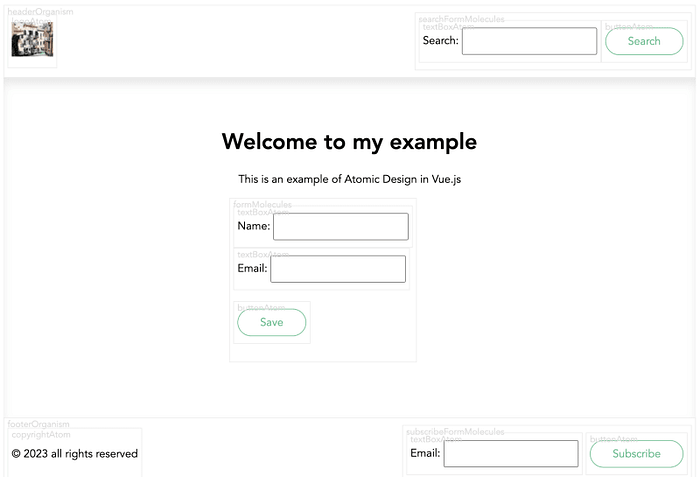

---
prev:
  text: '返回前端手册'
  link: '../'
---


# Vue.js 中引入原子设计

原子设计是一种创建设计系统的方法，它将用户界面分解为可重用的小组件，即：
1. Atoms 原子
2. Molecules 分子
3. Organisms 生物体
4. Templates 模板
5. Pages 页面


通过遵循模块化设计方法，原子设计可帮助团队创建一致、可扩展且可维护的 UI。.

在这篇文章中，为了简单起见，我们将探索如何仅使用 HTML 在 Vue.js 中实现原子设计。我将从原子设计的基础知识开始，然后演示如何在 Vue.js 中应用其原则。
在文章的最后，您将看到一个由页眉、表单和页脚组成的页面。您可以使用此处的示例应用于任何 UI 框架。


您可能会注意到每个组件周围都有边框。这是故意的，这样您就可以识别它是原子、分子还是生物体。
原子设计由五个级别组成，表示 UI 的构建基块。对于此示例，小编创建了一个倒置树结构，以可视化每个解剖结构的连接方式。 


## 原子 Atoms
原子是 UI 的最小单元，无法在不失去其含义的情况下进一步分解。原子的示例包括图标、按钮、标签、输入和排版。
在 Vue.js 中，原子可以创建为可重用的组件，这些组件接受 props 来自定义它们的外观和行为。
**TextboxAtom**


```Vue
<template>
  <div class="component-wrapper" data-name="textBoxAtom">
    <label>{{ label }}: <input type="text" :placeholder="placeHolder" /></label>
  </div>
</template> 

<script>
  export default { 
    name: 'TextBoxAtom', 
    props: { 
      label: {
        type: String,
        default: 'labelName'
      }, 
      placeHolder: String, 
    }, 
  }; 
</script>
<style scoped>
  input{
    padding: 0.75em 2em;
  }
</style>
```

**Button**


```vue
<template>
 <div class="component-wrapper" data-name="buttonAtom">
  <button :disabled="disabled"> 
    <slot>Button</slot>
  </button> 
 </div>
</template> 

<script>
export default { 
  name: 'ButtonAtom', 
  props: { 
    type: String, 
    size: String, 
    disabled: Boolean,
  },  
}; 
</script>
<style scoped>
button {
  color: #4fc08d;
}
button {
  background: none;
  border: solid 1px;
  border-radius: 2em;
  font: inherit;
  padding: 0.5em 2em;
}
</style>
```

**Logo**


```vue
<template>
  <div class="component-wrapper" data-name="logoAtom">
    
  </div>
</template>

<script>
export default {
  props: {
    width: {
      type: Number,
      default: 50
    },
    height: {
      type: Number,
      default: 50
    }
  },
  computed: {
    computedImageUrl() {
      return `https://picsum.photos/${this.width}/${this.height}`
    }
  }
};
</script>
```

## 分子 Molecules

分子是两个或多个原子的组合，它们共同作用以执行特定功能。在 Vue.js 中，可以通过将原子组合为父组件中的子组件来创建分子。分子的示例包括表单、搜索栏、导航菜单和卡片。

参考上面的例子，我们需要组合原子来创建以下分子：

**Subscribe Form Molecule**


```vue
<template>
  <form class="component-wrapper" data-name="subscribeFormMolecules">
    <TextboxAtom label="Email" />
    &nbsp;
    <ButtonAtom>Subscribe</ButtonAtom>
  </form>
</template>

<script>
import TextboxAtom from "https://codepen.io/haroonth/pen/LYXgdKg.js";
import ButtonAtom from "https://codepen.io/haroonth/pen/BaGqrJg.js";
export default {
  components: { ButtonAtom, TextboxAtom }
};
</script>
<style scoped>
form {
  display: inline-flex;
}
</style>
```

**Search Form Molecule**


```vue
<template>
  <form class="component-wrapper" data-name="searchFormMolecules">
    <InputAtom label="Search" />
    <ButtonAtom>Search</ButtonAtom>
  </form>
</template>

<script>
import InputAtom from "https://codepen.io/haroonth/pen/LYXgdKg.js";
import ButtonAtom from "https://codepen.io/haroonth/pen/BaGqrJg.js";
export default {
  components: { ButtonAtom, InputAtom }
};
</script>
<style scoped>
form {
  display: inline-flex;
}
</style>
```

**Form Molecule**


```vue
<template>
  <div class="form-molecule component-wrapper" data-name="formMolecules">
    <div><InputAtom :label="nameLabel" :placeholder="namePlaceholder" /></div>
    <div><InputAtom :label="emailLabel" :placeholder="emailPlaceholder" /></div>
    <p>
      <ButtonAtom :disabled="isSubmitDisabled">
        {{ submitLabel || "Button" }}
      </ButtonAtom>
    </p>
  </div>
</template>

<script>
import InputAtom from "https://codepen.io/haroonth/pen/LYXgdKg.js";
import ButtonAtom from "https://codepen.io/haroonth/pen/BaGqrJg.js";
export default {
  name: "FormMolecule",
  components: {
    InputAtom,
    ButtonAtom
  },
  props: {
    nameLabel: String,
    namePlaceholder: String,
    emailLabel: String,
    emailPlaceholder: String,
    submitLabel: String,
    isSubmitDisabled: Boolean
  }
};
</script>
```

## Organisms 生物体

有机体是形成 UI 不同部分的分子组合，例如页眉、页脚、侧边栏和内容块。在 Vue.js 中，可以通过将分子组合为布局组件中的子组件来创建有机体。

**Header Organism**


```vue
<template>
  <header class="component-wrapper" data-name="headerOrganism">
    <LogoAtom width="60" />
    <SearchFormMoecules />
  </header>
</template>

<script>
import SearchFormMoecules from "https://codepen.io/haroonth/pen/zYMmjqa.js";
import LogoAtom from "https://codepen.io/haroonth/pen/xxQMbeJ.js";
export default {
  components: { SearchFormMoecules, LogoAtom }
};
</script>
<style scoped>
header {
  min-height: 50px;
  display: flex;
  justify-content: space-between;
  align-items: center;
}
</style>
```

**Content Organism**


```vue
<template>
  <div class="page-organism">
    <div class="content-wrapper-title">
      <h1><slot name="title">Here might be a page title</slot></h1>
      <p><slot name="description">Here might be a page description</slot></p>
    </div>
    <slot>...</slot>
    <!--   This might includes some molecules or atoms   -->
  </div>
</template>
<script>
export default {
  name: "ContentOrganism",
  components: {}
};
</script>
<style scoped>
.page-organism {
  padding-top: 50px;
  padding-bottom: 80px;
  box-shadow: inset 0px 10px 15px -3px rgba(0, 0, 0, 0.1);
}
.content-wrapper-title {
  text-align: center;
}
</style>
```

**Footer Organism**


```vue
<template>
  <footer class="component-wrapper" data-name="footerOrganism">
    <CopyrightAtom />
    <SubscribeFormMoecules />
  </footer>
</template>

<script>
import SubscribeFormMoecules from "https://codepen.io/haroonth/pen/ExOrarL.js";
import LogoAtom from "https://codepen.io/haroonth/pen/xxQMbeJ.js";
import CopyrightAtom from "https://codepen.io/haroonth/pen/gOQqOBj.js";
export default {
  components: { SubscribeFormMoecules, LogoAtom, CopyrightAtom }
};
</script>
<style scoped>
footer {
  display: flex;
  justify-content: space-between;
  align-items: center;
}
</style>
```

## Templates 模板

模板是通过指定区域（例如页眉、页脚和内容区域）内有机体的位置和大小来定义页面布局和组成的结构。

在 Vue.js 中，可以将模板创建为接受子组件的命名槽的父组件。将 3 种生物体应用到模板概念中，它可能是这样的。


```vue
<template>
  <div class="full-layout-template">
    <HeaderOrganism />
    <ContentOrganism class="content">
      <template #title>
        <slot name="title">default title</slot>
      </template>
      <template #description>
        <slot name="description">default description</slot>
      </template>
      <slot />
    </ContentOrganism>
    <FooterOrganism class="page-footer" />
  </div>
</template>
<script>
import HeaderOrganism from "https://codepen.io/haroonth/pen/WNYaJGR.js";
import ContentOrganism from "https://codepen.io/haroonth/pen/vYQbOeO.js";
import FooterOrganism from "https://codepen.io/haroonth/pen/RwqvPRN.js";
export default {
  name: "FullLayoutTemplate",
  components: {
    HeaderOrganism,
    ContentOrganism,
    FooterOrganism
  }
};
</script>
<style scoped>
.full-layout-template {
  display: flex;
  flex-direction: column;
  min-height: 90vh;
}
.content {
  flex: 1 0 auto;
}
.page-footer {
  flex-shrink: 0;
}
</style>
```

## Pages 页面

页面是 UI 的最终呈现，它将模板与特定内容结合起来形成完整的视图。在原子设计中，页面就像模板的实例，代表用户的独特体验。

在 Vue.js 中，可以通过复制模板并将其插槽替换为实际内容来创建页面。尽管在本示例中，我仅更改 Content Organism 的内容，但您可以选择更改全部内容或不更改任何内容。



```vue
<template>
  <FullLayoutTemplate>
    <template #title>{{ title }}</template>
    <template #description>{{ description }}</template>
    <div class="fixed-width">
      <FormMolecule nameLabel="Name" emailLabel="Email" submitLabel="Save" />
    </div>
  </FullLayoutTemplate>
</template>
<script>
import FullLayoutTemplate from "https://codepen.io/haroonth/pen/GRwzpxx.js";
import FormMolecule from "https://codepen.io/haroonth/pen/PoxyRMo.js";
export default {
  name: "HomePage",
  components: {
    FullLayoutTemplate,
    FormMolecule
  },
  data() {
    return {
      title: "Welcome to my example",
      description: "This is an example of Atomic Design in Vue.js",
      copyright: "Copyright © 2023"
    };
  }
};
</script>
<style scoped>
* {
  font-family: Avenir, Helvetica, Arial, sans-serif;
}
.fixed-width {
  max-width: 350px;
  margin: 0 auto;
}
</style>
```

# Vue.js 中原子设计的好处

通过在 Vue.js 中使用原子设计，您可以获得多种好处，例如：

1. 一致性：通过创建可重用的组件，您可以确保您的 UI 在所有页面上的外观和行为一致。
2. 可扩展性：通过将 UI 分解为小块，您可以轻松添加、删除或更新组件，而不会影响系统的其他部分。
3. 可维护性：通过将组件组织到文件夹和文件中，您可以轻松地查找、编辑或调试它们，而与系统的其他部分隔离。
4. 可重用性：通过创建独立的组件，您可以在其他项目中重用它们或与社区共享它们，从而节省时间和精力。

原子设计是一种强大的方法，可以帮助您在 Vue.js 中设计更好的 UI。通过遵循其原则，您可以创建可重用、模块化和可扩展的组件，使您的代码更易于维护，让您的用户更满意。所以，继续尝试一下，然后让我知道它对你来说效果如何！
