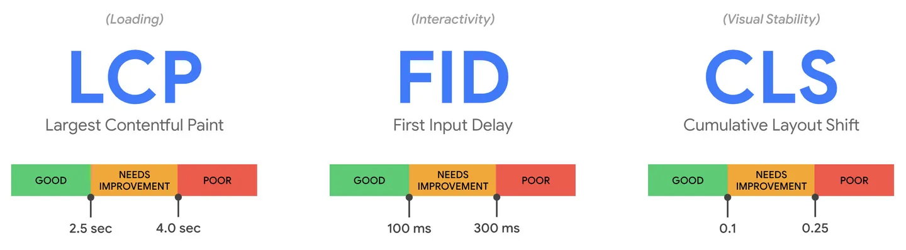
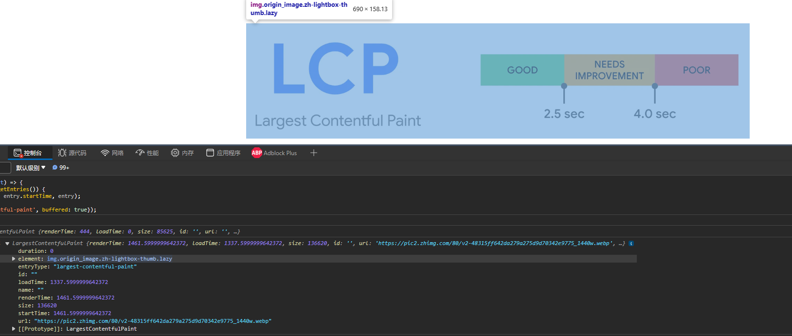
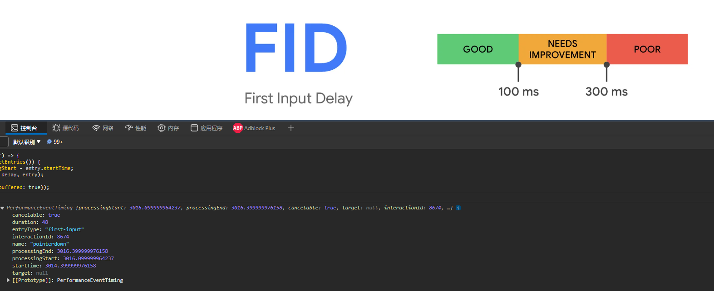
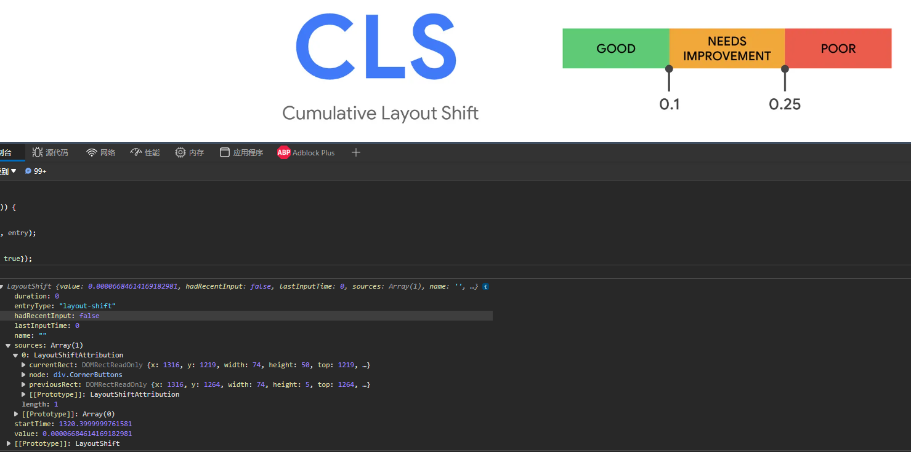

# Core Web Vitals



- **[Largest Contentful Paint (LCP)](https://w3c.github.io/largest-contentful-paint/)**: 测量加载性能。为了能提供较好的用户体验，LCP 指标建议页面首次加载要在 2.5s 内完成。
- **[First Input Delay (FID)](https://developer.mozilla.org/en-US/docs/Glossary/First_input_delay)**: 测量交互性能。为了提供较好用户体验，交互时间建议在 100ms 或以内。
- **[Cumulative Layout Shift (CLS)](https://web.dev/articles/cls)**: 测量视觉稳定性。为了提供较好用户体验，页面应该维持 CLS 在 0.1 或以内。

当页面访问量有 75%的数据达到了以上以上 Good 的标准，则认为性能是不错的了。

Core Web Vitals 是作为核心性能指标，但是其他指标也同样在重要，是做为核心指标的一个辅助。例如，TTFB 和 FCP 都可以用来衡量加载性能(服务器响应时间和渲染时间)，它们作为 LCP 的一个问题手段辅助。同样的，TBT 和 TTI 对于衡量交互性能也很重要，是 FID 的一个辅助，但是它们无法在线上进行测量，也无法反映以用户为中心的结果。

Google 官方提供了一个 **[web-vitals](https://link.zhihu.com/?target=https%3A//github.com/GoogleChrome/web-vitals)** 库，线上或本地都可以测量上面提到的 3 个指标：

```javascript
import {getCLS, getFID, getLCP} from 'web-vitals';

function sendToAnalytics(metric) {
  const body = JSON.stringify(metric);
  // Use `navigator.sendBeacon()` if available, falling back to `fetch()`.
  (navigator.sendBeacon && navigator.sendBeacon('/analytics', body)) ||
      fetch('/analytics', {body, method: 'POST', keepalive: true});
}

getCLS(sendToAnalytics);
getFID(sendToAnalytics);
getLCP(sendToAnalytics);
```


## LCP

**测量**

```javascript
new PerformanceObserver((entryList) => {
  for (const entry of entryList.getEntries()) {
    console.log('LCP candidate:', entry.startTime, entry);
  }
}).observe({type: 'largest-contentful-paint', buffered: true});
```



::: danger
注意：IE 不支持
:::


## FID

**测量**

```javascript
new PerformanceObserver((entryList) => {
  for (const entry of entryList.getEntries()) {
    const delay = entry.processingStart - entry.startTime;
    console.log('FID candidate:', delay, entry);
  }
}).observe({type: 'first-input', buffered: true});
```




## CLS

**测量**

```javascript
let cls = 0;
new PerformanceObserver((entryList) => {
  for (const entry of entryList.getEntries()) {
    if (!entry.hadRecentInput) {
      cls += entry.value;
      console.log('Current CLS value:', cls, entry);
    }
  }
}).observe({type: 'layout-shift', buffered: true});
```



