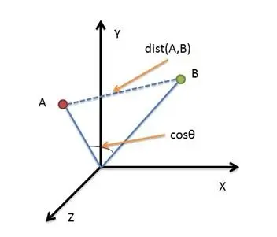
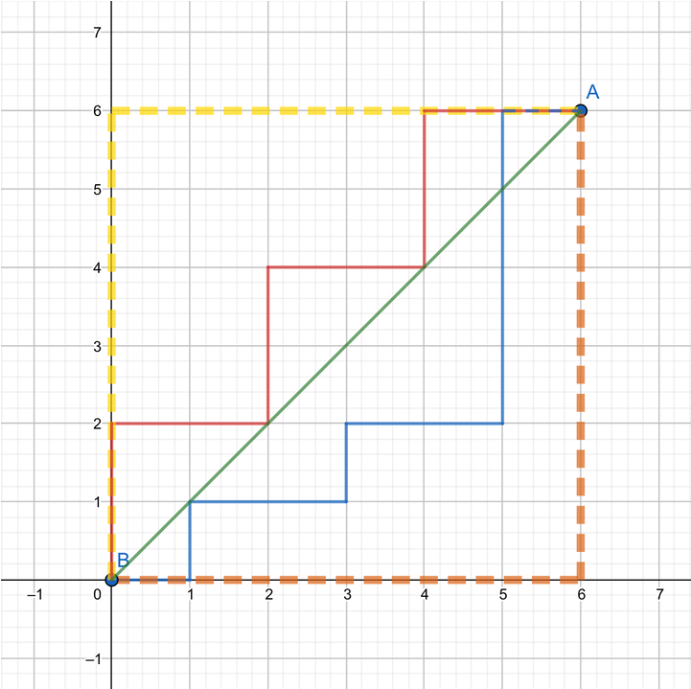
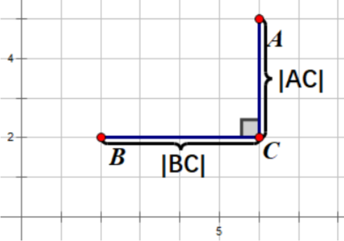

---
prev:
  text: '返回前端手册'
  link: '../'
---

# 计算两点的距离
> [参考文档](https://baijiahao.baidu.com/s?id=1690546966551155113&wfr=spider&for=pc)

## (常用)欧氏距离(Euclidean Distance)



1. 二维平面, A(x1,y1)、B(x2,y2)
$$ D_{Distance} = \sqrt{(x_2 - x_1)^2 + (y_2 - y_1)^2} $$

2. 三维空间, A(x1,y1,z1)、B(x2,y2,z2)
$$ D_{Distance} = \sqrt{(x_2 - x_1)^2 + (y_2 - y_1)^2 + (z_2 - z_1)^2} $$

3. N维空间, A(x11,x12,x13...,x1n)、B(x21,x22,x23...,x2n)
$$ D_{Distance} = \sqrt{\sum_{n=1}^\infty (x_{2n} - x_{1n})^2} $$

**没有使用框架：**

```typescript
function euclideanDistance(point1: number[], point2: number[]): number {
  if (point1.length !== point2.length) {
    throw new Error('Points must have the same dimensionality');
  }

  let sum = 0;
  for (let i = 0; i < point1.length; i++) {
    sum += Math.pow(point1[i] - point2[i], 2);
  }
  return Math.sqrt(sum);
}

// Example usage
const point1: number[] = [1, 2, 3];
const point2: number[] = [4, 5, 6];
console.log(euclideanDistance(point1, point2)); // Output: 5.196152422706632
```

**使用 Three：**
```typescript
import * as THREE from 'three';
function euclideanDistance(point1: THREE.Vector3, point2: THREE.Vector3): number {
  return point1.distanceTo(point2);
}
// Example usage
const point1 = new THREE.Vector3(1, 2, 3);
const point2 = new THREE.Vector3(4, 5, 6);
console.log(euclideanDistance(point1, point2)); // Output: 5.196152422706632
```

## 曼哈顿距离(Manhattan Distance)



1. 二维平面, A(x1,y1)、B(x2,y2)
$$ D_{Distance} = |x_2 - x_1| + |y_2 - y_1 | $$

2. 三维空间, A(x1,y1,z1)、B(x2,y2,z2)
$$ D_{Distance} = |x_2 - x_1| + |y_2 - y_1 | + |z_2 - z_1 | $$

3. N维空间, A(x11,x12,x13...,x1n)、B(x21,x22,x23...,x2n)
$$ D_{Distance} = \sum_{n=1}^\infty |x_{2n} - x_{1n}| $$

**没有使用框架：**
```typescript
function manhattanDistance(point1: number[], point2: number[]): number {
  if (point1.length !== point2.length) {
    throw new Error('Points must have the same dimensionality');
  }

  let sum = 0;
  for (let i = 0; i < point1.length; i++) {
    sum += Math.abs(point1[i] - point2[i]);
  }
  return sum;
}

// Example usage
const point1: number[] = [1, 2, 3];
const point2: number[] = [4, 5, 6];
console.log(manhattanDistance(point1, point2)); // Output: 9
```

**使用 Three：**
```typescript
import * as THREE from 'three';

function manhattanDistance(point1: THREE.Vector3, point2: THREE.Vector3): number {
  return Math.abs(point1.x - point2.x) + Math.abs(point1.y - point2.y) + Math.abs(point1.z - point2.z);
}

// Example usage
const point1 = new THREE.Vector3(1, 2, 3);
const point2 = new THREE.Vector3(4, 5, 6);
console.log(manhattanDistance(point1, point2)); // Output: 9
```


## 切比雪夫距离(Chebyshev Distance)



1. 二维平面, A(x1,y1)、B(x2,y2)
$$ D_{Distance} = max(|x_2 - x_1|,|y_2 - y_1|) $$
2. 三维空间, A(x1,y1,z1)、B(x2,y2,z2)
$$ D_{Distance} = max(|x_2 - x_1|,|y_2 - y_1|,|z_2 - z_1|) $$
3. N维空间, A(x11,x12,x13...,x1n)、B(x21,x22,x23...,x2n)
$$ D_{Distance} = max(|x_{2n} - x_{1n}|) $$

**没有使用框架：**
```typescript
function chebyshevDistance(point1: number[], point2: number[]): number {
  if (point1.length !== point2.length) {
    throw new Error('Points must have the same dimensionality');
  }

  let maxDifference = 0;
  for (let i = 0; i < point1.length; i++) {
    const difference = Math.abs(point1[i] - point2[i]);
    if (difference > maxDifference) {
      maxDifference = difference;
    }
  }
  return maxDifference;
}

// Example usage
const point1: number[] = [1, 2, 3];
const point2: number[] = [4, 5, 6];
console.log(chebyshevDistance(point1, point2)); // Output: 3
```

**使用 Three：**
```typescript
import * as THREE from 'three';

function chebyshevDistance(point1: THREE.Vector3, point2: THREE.Vector3): number {
  const diffX = Math.abs(point1.x - point2.x);
  const diffY = Math.abs(point1.y - point2.y);
  const diffZ = Math.abs(point1.z - point2.z);
  return Math.max(diffX, diffY, diffZ);
}

// Example usage
const point1 = new THREE.Vector3(1, 2, 3);
const point2 = new THREE.Vector3(4, 5, 6);
console.log(chebyshevDistance(point1, point2)); // Output: 3
```


## 闵可夫斯基距离(Minkowski Distance)
1. 二维平面, A(x1,y1)、B(x2,y2)
$$ D_{Distance} = \sqrt[p]{|x_2 - x_1|^p + |y_2 - y_1|^p } $$

2. 三维空间, A(x1,y1,z1)、B(x2,y2,z2)
$$ D_{Distance} = \sqrt[p]{|x_2 - x_1|^p + |y_2 - y_1|^p + |z_2 - z_1|^p } $$

3. N维空间, A(x11,x12,x13...,x1n)、B(x21,x22,x23...,x2n)
$$ D_{Distance} = \sqrt[p]{\sum_{n=1}^\infty |x_{2n} - x_{1n}|^p } $$

::: tip
1. 当p=1时，就是[曼哈顿距离(Manhattan Distance)](./distanceAndAngle#曼哈顿距离-manhattan-distance);
2. 当p=2时，就是[欧氏距离(Euclidean Distance)](./distanceAndAngle#欧氏距离-euclidean-distance);
3. 当p→∞时，就是[切比雪夫距离(Chebyshev Distance)](./distanceAndAngle#切比雪夫距离-chebyshev-distance);
:::

**沒有使用框架：**

```typescript
function minkowskiDistance(point1: number[], point2: number[], p: number): number {
  if (point1.length !== point2.length) {
    throw new Error('Points must have the same dimensionality');
  }

  let sum = 0;
  for (let i = 0; i < point1.length; i++) {
    sum += Math.pow(Math.abs(point1[i] - point2[i]), p);
  }
  return Math.pow(sum, 1/p);
}

// Example usage
const point1: number[] = [1, 2, 3];
const point2: number[] = [4, 5, 6];
console.log(minkowskiDistance(point1, point2, 2)); // Output: 5.196152422706632 (Euclidean distance)
console.log(minkowskiDistance(point1, point2, 1)); // Output: 9 (Manhattan distance)
console.log(minkowskiDistance(point1, point2, Infinity)); // Output: 3 (Chebyshev distance)
```

**使用 Three：**

```typescript
import * as THREE from 'three';

function minkowskiDistance(point1: THREE.Vector3, point2: THREE.Vector3, p: number): number {
  const sum = Math.pow(Math.abs(point1.x - point2.x), p) +
              Math.pow(Math.abs(point1.y - point2.y), p) +
              Math.pow(Math.abs(point1.z - point2.z), p);
  return Math.pow(sum, 1/p);
}

// Example usage
const point1 = new THREE.Vector3(1, 2, 3);
const point2 = new THREE.Vector3(4, 5, 6);
console.log(minkowskiDistance(point1, point2, 2)); // Output: 5.196152422706632 (Euclidean distance)
console.log(minkowskiDistance(point1, point2, 1)); // Output: 9 (Manhattan distance)
console.log(minkowskiDistance(point1, point2, Infinity)); // Output: 3 (Chebyshev distance)
```


# 计算两个向量的角度

## 余弦距离(Cosine Distance)
1. 二维平面, A(x1,y1)、B(x2,y2)
$$ cos(θ) = \frac{x_1x_2 + y_1y_2}{\sqrt{x_1^2 + y_1^2}\sqrt{x_2^2 + y_2^2}} $$

2. 三维空间, A(x1,y1,z1)、B(x2,y2,z2)
$$ cos(θ) = \frac{x_1x_2 + y_1y_2 + z_1z_2}{\sqrt{x_1^2 + y_1^2 + z_1^2}\sqrt{x_2^2 + y_2^2 + z_2^2}} $$

3. N维空间, A(x11,x12,x13...,x1n)、B(x21,x22,x23...,x2n)
$$ cos(θ) = \frac{\sum_{n=1}^\infty x_{1n}x_{2n}}{\sqrt{\sum_{n=1}^\infty x_{1n}^2}\sqrt{\sum_{n=1}^\infty x_{2n}^2}} $$

**没有使用框架：**
```typescript
function cosineDistance(vector1: number[], vector2: number[]): number {
  if (vector1.length !== vector2.length) {
    throw new Error('Vectors must have the same dimensionality');
  }

  let dotProduct = 0;
  let magnitude1 = 0;
  let magnitude2 = 0;
  for (let i = 0; i < vector1.length; i++) {
    dotProduct += vector1[i] * vector2[i];
    magnitude1 += Math.pow(vector1[i], 2);
    magnitude2 += Math.pow(vector2[i], 2);
  }
  magnitude1 = Math.sqrt(magnitude1);
  magnitude2 = Math.sqrt(magnitude2);

  return 1 - (dotProduct / (magnitude1 * magnitude2));
}

// Example usage
const vector1: number[] = [1, 2, 3];
const vector2: number[] = [4, 5, 6];
console.log(cosineDistance(vector1, vector2));
```

**使用 Three：**
```typescript
import * as THREE from 'three';

function cosineDistance(vector1: THREE.Vector3, vector2: THREE.Vector3): number {
  const dotProduct = vector1.dot(vector2);
  const magnitude1 = vector1.length();
  const magnitude2 = vector2.length();

  return 1 - (dotProduct / (magnitude1 * magnitude2));
}

// Example usage
const vector1 = new THREE.Vector3(1, 2, 3);
const vector2 = new THREE.Vector3(4, 5, 6);
console.log(cosineDistance(vector1, vector2));
```


# 计算点到线段的距离

**没有使用框架**

```typescript
function pointToLineSegmentDistance(point: number[], lineStart: number[], lineEnd: number[]): number {
  const lineLengthSquared = Math.pow(lineEnd[0] - lineStart[0], 2) + Math.pow(lineEnd[1] - lineStart[1], 2);
  if (lineLengthSquared === 0) {
    return Math.sqrt(Math.pow(point[0] - lineStart[0], 2) + Math.pow(point[1] - lineStart[1], 2));
  }

  const t = Math.max(0, Math.min(1, ((point[0] - lineStart[0]) * (lineEnd[0] - lineStart[0]) + (point[1] - lineStart[1]) * (lineEnd[1] - lineStart[1])) / lineLengthSquared));
  const projectionX = lineStart[0] + t * (lineEnd[0] - lineStart[0]);
  const projectionY = lineStart[1] + t * (lineEnd[1] - lineStart[1]);

  return Math.sqrt(Math.pow(point[0] - projectionX, 2) + Math.pow(point[1] - projectionY, 2));
}

// Example usage
const point: number[] = [1, 1];
const lineStart: number[] = [2, 2];
const lineEnd: number[] = [4, 4];
console.log(pointToLineSegmentDistance(point, lineStart, lineEnd));
```


**使用 Three**

```typescript
import * as THREE from 'three';

function pointToLineSegmentDistance(point: THREE.Vector3, lineStart: THREE.Vector3, lineEnd: THREE.Vector3): number {
  const line = new THREE.Line3(lineStart, lineEnd);
  const pointOnLine = line.closestPointToPoint(point, true, new THREE.Vector3());
  return point.distanceTo(pointOnLine);
}

// Example usage
const point = new THREE.Vector3(1, 1, 1);
const lineStart = new THREE.Vector3(2, 2, 2);
const lineEnd = new THREE.Vector3(4, 4, 4);
console.log(pointToLineSegmentDistance(point, lineStart, lineEnd));
```


# 计算三个点所构成的角度

**没有使用框架**

```typescript
function calculateAngle(point1: number[], point2: number[], point3: number[]): number {
  const vector1 = [point1[0] - point2[0], point1[1] - point2[1], point1[2] - point2[2]];
  const vector2 = [point3[0] - point2[0], point3[1] - point2[1], point3[2] - point2[2]];

  const dotProduct = vector1[0] * vector2[0] + vector1[1] * vector2[1] + vector1[2] * vector2[2];
  const magnitude1 = Math.sqrt(vector1[0] * vector1[0] + vector1[1] * vector1[1] + vector1[2] * vector1[2]);
  const magnitude2 = Math.sqrt(vector2[0] * vector2[0] + vector2[1] * vector2[1] + vector2[2] * vector2[2]);

  const cosTheta = dotProduct / (magnitude1 * magnitude2);
  return Math.acos(cosTheta) * (180 / Math.PI); // Convert radians to degrees
}

// Example usage
const point1: number[] = [1, 2, 3];
const point2: number[] = [4, 5, 6];
const point3: number[] = [7, 8, 9];
console.log(calculateAngle(point1, point2, point3));
```

**使用 Three**

```typescript
import * as THREE from 'three';

function calculateAngle(point1: THREE.Vector3, point2: THREE.Vector3, point3: THREE.Vector3): number {
  const vector1 = new THREE.Vector3().subVectors(point1, point2);
  const vector2 = new THREE.Vector3().subVectors(point3, point2);

  vector1.normalize();
  vector2.normalize();

  return vector1.angleTo(vector2) * (180 / Math.PI); // Convert radians to degrees
}

// Example usage
const point1 = new THREE.Vector3(1, 2, 3);
const point2 = new THREE.Vector3(4, 5, 6);
const point3 = new THREE.Vector3(7, 8, 9);
console.log(calculateAngle(point1, point2, point3));
```


# 计算四个点所构成的二面角

**没有使用框架**

```typescript
function calculateDihedralAngle(point1: number[], point2: number[], point3: number[], point4: number[]): number {
  const vector1 = [point2[0] - point1[0], point2[1] - point1[1], point2[2] - point1[2]];
  const vector2 = [point3[0] - point2[0], point3[1] - point2[1], point3[2] - point2[2]];
  const vector3 = [point4[0] - point3[0], point4[1] - point3[1], point4[2] - point3[2]];

  const normal1 = [
    vector1[1] * vector2[2] - vector1[2] * vector2[1],
    vector1[2] * vector2[0] - vector1[0] * vector2[2],
    vector1[0] * vector2[1] - vector1[1] * vector2[0]
  ];

  const normal2 = [
    vector2[1] * vector3[2] - vector2[2] * vector3[1],
    vector2[2] * vector3[0] - vector2[0] * vector3[2],
    vector2[0] * vector3[1] - vector2[1] * vector3[0]
  ];

  const dotProduct = normal1[0] * normal2[0] + normal1[1] * normal2[1] + normal1[2] * normal2[2];
  const magnitude1 = Math.sqrt(normal1[0] * normal1[0] + normal1[1] * normal1[1] + normal1[2] * normal1[2]);
  const magnitude2 = Math.sqrt(normal2[0] * normal2[0] + normal2[1] * normal2[1] + normal2[2] * normal2[2]);

  const cosTheta = dotProduct / (magnitude1 * magnitude2);
  return Math.acos(cosTheta) * (180 / Math.PI); // Convert radians to degrees
}

// Example usage
const point1: number[] = [1, 2, 3];
const point2: number[] = [4, 5, 6];
const point3: number[] = [7, 8, 9];
const point4: number[] = [10, 11, 12];
console.log(calculateDihedralAngle(point1, point2, point3, point4));

```


**使用 Three**

```typescript
import * as THREE from 'three';

function calculateDihedralAngle(point1: THREE.Vector3, point2: THREE.Vector3, point3: THREE.Vector3, point4: THREE.Vector3): number {
  const vector1 = new THREE.Vector3().subVectors(point2, point1);
  const vector2 = new THREE.Vector3().subVectors(point3, point2);
  const vector3 = new THREE.Vector3().subVectors(point4, point3);

  const normal1 = new THREE.Vector3().crossVectors(vector1, vector2).normalize();
  const normal2 = new THREE.Vector3().crossVectors(vector2, vector3).normalize();

  const dotProduct = normal1.dot(normal2);
  const angle = Math.acos(Math.max(-1, Math.min(1, dotProduct))); // Clamp to the range [-1, 1] to avoid NaN

  const sign = vector1.dot(new THREE.Vector3().crossVectors(vector2, vector3));
  return angle * (sign < 0 ? -1 : 1); // Use the sign of the dot product to determine the angle sign
}

// Example usage
const point1 = new THREE.Vector3(1, 2, 3);
const point2 = new THREE.Vector3(4, 5, 6);
const point3 = new THREE.Vector3(7, 8, 9);
const point4 = new THREE.Vector3(10, 11, 12);
console.log(calculateDihedralAngle(point1, point2, point3, point4));
```


# 四元素旋转

## 知道起点和终点

```typescript
import * as THREE from 'three';

// 原始点和最终点
const originalPoint = new THREE.Vector3(1, 0, 0);
const finalPoint = new THREE.Vector3(0, 1, 0);

// 计算旋转所需的四元数
const quaternion = new THREE.Quaternion();
quaternion.setFromUnitVectors(originalPoint.clone().normalize(), finalPoint.clone().normalize());

console.log(quaternion);
```


### 知道起点和旋转轴

```typescript
import * as THREE from 'three';

// 起点
const startPoint = new THREE.Vector3(1, 0, 0);
// 旋转轴
const axis = new THREE.Vector3(0, 1, 0);
// 角度
const angle = Math.PI / 2; // 90度
// 计算四元素旋转
const quaternion = new THREE.Quaternion();
quaternion.setFromAxisAngle(axis, angle);
// 应用四元素旋转到起点
const rotatedPoint = startPoint.clone().applyQuaternion(quaternion);
console.log(rotatedPoint);
```

