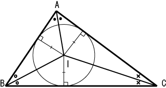

# 内切圆
> 在数学中，若一个二维平面上的多边形的每条边都能与其内部的一个圆形相切，该圆就是多边形的内切圆，这时称这个多边形为圆外切多边形。它亦是多边形内部最大的圆形。内切圆的圆心被称为该多边形的内心。



在直角座标系中，若顶点的座标分别为

$$ {\displaystyle (x_{1},y_{1},z_{1})}、{\displaystyle (x_{2},y_{2},z_{2})}、{\displaystyle (x_{3},y_{3},z_{3})} $$

则内心的座标为：
$$ {\displaystyle ({\frac {ax_{1}+bx_{2}+cx_{3}}{a+b+c}},{\frac {ay_{1}+by_{2}+cy_{3}}{a+b+c}},{\frac {az_{1}+bz_{2}+cz_{3}}{a+b+c}})} $$

## 实现（3维版本）
```javascript
/**
 * 参考地址：https://zh.wikipedia.org/wiki/%E5%86%85%E5%88%87%E5%9C%86
 * @description 计算三角形内心
 * @author rxh
 * @date 2022-08-22
 */
export const calcIncentre = function() {
  const point = new Vector3(0,0,0);
  const point1 = new Vector3(1,1,1);
  const point2 = new Vector3(1,2,1);

  const a = point.clone().sub(point1).length();
  const b = point1.clone().sub(point2).length();
  const c = point2.clone().sub(point).length();
  
  const matrix = new Matrix3().set(
    point.x, point1.x, point2.x,
    point.y, point1.y, point2.y,
    point.z, point1.z, point2.z
  )

  const scalar = 1 / (a + b + c)
  return new Vector3(a,b,c).applyMatrix3(matrix).multiplyScalar(scalar).clone()
};
```
